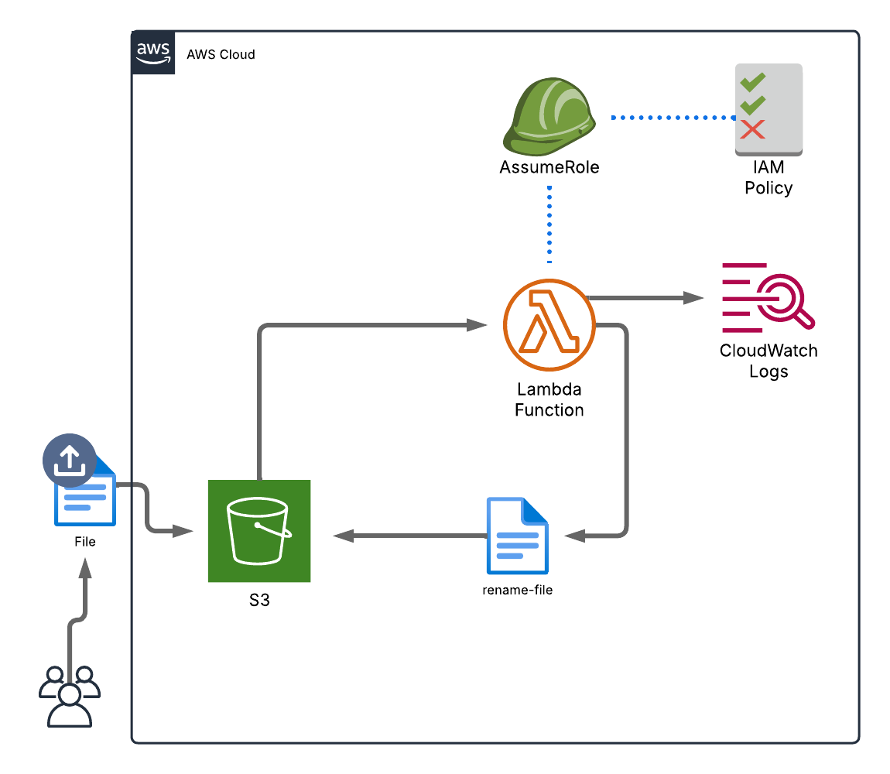

# S3 Rename Function with AWS Lambda and Terraform

## Overview

This project sets up an AWS Lambda function to automatically rename files uploaded to an S3 bucket. The Lambda function is triggered by S3 events and renames files by prepending "rename-" to the new object's key. This serves as a straightforward POC project.

## Architecture

### Architecture Diagram


### Architecture Overview

- **Lambda Function:** Deployed as `s3_rename_function`, listens for S3 events, renames files by adding "renamed-" prefix, and deletes the original file.
- **S3 Bucket:** Created with a prefix (e.g., "rename-test-"); stores files to be renamed.
- **S3 Event Notification:** Configured on the S3 bucket to trigger the Lambda function when a new object is created.
- **IAM Roles and Policies:** An IAM role is assumed by the Lambda function with an attached policy that grants permissions to interact with S3 and write logs to CloudWatch.


## Tools

- **Terraform**: Used for infrastructure as code (IaC) deployment.
- **Python**: Used to write the Lambda function
- **Boto3**: The AWS Python SDK and client library to wrap API calls
- **AWS CLI Utility**: Used for quicker interactions and streamlining workflow

## Quick Start: ClickOps Guide


### **1. Open the AWS Console**  
Open tabs for the **S3**, **Lambda**, and **IAM** dashboards.  

### **2. Set Up IAM Role**  
- The Lambda function needs permissions to access **CloudWatch Logs** and **S3**.  
- Since Lambda does not have a persistent identity, it assumes a role using **AWS STS (Security Token Service)**.  

#### **Steps:**  
1. Open the **IAM** dashboard.  
2. Navigate to **Roles** → **Create role**.  
3. Leave the default selection for **Trusted entity type** as **AWS Service** (since Lambda will assume this role).  
4. Under **Use case**, select **Lambda**, then click **Next**.  
5. Attach the following policies:  
   - **AWSLambdaBasicExecutionRole** (for CloudWatch logging).  
   - **AmazonS3FullAccess** (consider a more restrictive policy if needed).  
6. Click **Next**, name the role, review the settings, and click **Create Role**.  

### **3. Create a Lambda Function**  
- Copy the required code from [here](src/lambda_function.py).  

#### **Steps:**  
1. Open the **Lambda** dashboard and click **Create function**.  
2. Enter a **Function name** and select **Python 3.11** as the runtime.  
3. Under **Execution role**:  
   - Click **Change default execution role**.  
   - Select **Use an existing role**.  
   - From the **Existing Role** dropdown, choose the role created in Step 2.  
4. Click **Create function**.  
5. Scroll down to the code editor, paste the Python code, and click **Deploy**.  

### **4. Create an S3 Bucket & Configure Event Notification**  

#### **Steps:**  
1. Open the **S3** dashboard.  
2. Click **Create bucket** and proceed with the default settings.  
3. Open the newly created bucket and navigate to the **Properties** tab.  
4. In the **Event notifications** section:  
   - Click **Create event notification**.  
   - Enter a **Notification name** (e.g., `"on-upload"`).  
   - Under **Event types**, select **s3:ObjectCreated:Put** (triggers on new file uploads).  
   - Under **Destination**, select **Choose your Lambda function** and pick the function created in Step 3.  
   - Click **Save changes**.  

### **5. Test the Setup**  
- Upload an object to the new S3 bucket.  
- Verify that the Lambda function is triggered by checking **CloudWatch Logs** for execution details.  


## Terraform Deploymen Instructions

### 1. Move to your projects folder
Move into your projects folder inside the TheoWAF directory on your computer for example. 

### 2. Clone the Repository


```sh
git clone https://github.com/aaron-dm-mcdonald/s3-object-renamer.git lambda-rename-s3
cd lambda-rename-s3
```

### 3. Initialize and Apply Terraform

```sh
terraform init
terraform apply -auto-approve
```

### 4. Get the Bucket Name

Note the bucket name during terraform runtime or execute:

```sh
terraform output s3_bucket_name
```

### 5. Upload a File (Triggering Lambda)

```sh
aws s3 cp <LOCAL-FILE-PATH> s3://<YOUR-BUCKET-NAME>/<YOUR-FILE-KEY>
```

### 6. List Files in Bucket

```sh
aws s3 ls s3://<YOUR-BUCKET-NAME>/
```

## Testing Lambda Manually

To test without an actual S3 event, use AWS CLI:

1) Edit the ```tests/event.json``` file with current info. This is a JSON formatted file:

2) Use jq to verify formatting (optional):
```jq . tests/event.json```

3) Use the aws CLI to invoke the lambda while passing in the JSON payload to simulate an S3 upload trigger:
```sh
aws lambda invoke --function-name s3_rename_function \
  --payload file://tests/event.json tests/response.json \
  --cli-binary-format raw-in-base64-out >> tests/output.txt
```


4) 
    - Run ```cat tests/response.json``` to view contents. Expected results are "null"
    - Run ```cat tests/output.txt``` to view output of the command. Expected results are a HTTP status code of 200.
   


## Notes

- Ensure that your IAM role allows S3 read/write access for Lambda.
- The Lambda function runs in response to S3 events, so any file upload matching the event filter will trigger it.

## Lambda Function Code Breakdown

This Lambda function listens for new file uploads to an S3 bucket and renames them by adding a **"renamed-"** prefix.

### **Key Steps in the Code**
1. **Imports AWS SDK (boto3) and urllib.parse** – Used for interacting with S3 and decoding filenames.
2. **Extracts the bucket name and file name** from the event payload.
3. **Creates a new file name** by adding the `"renamed-"` prefix.
4. **Copies the original file to the new name** in the same bucket.
5. **Deletes the original file** after copying.

### **Lambda Code**
[The Lambda Function Source Code](src/lambda_function.py)


